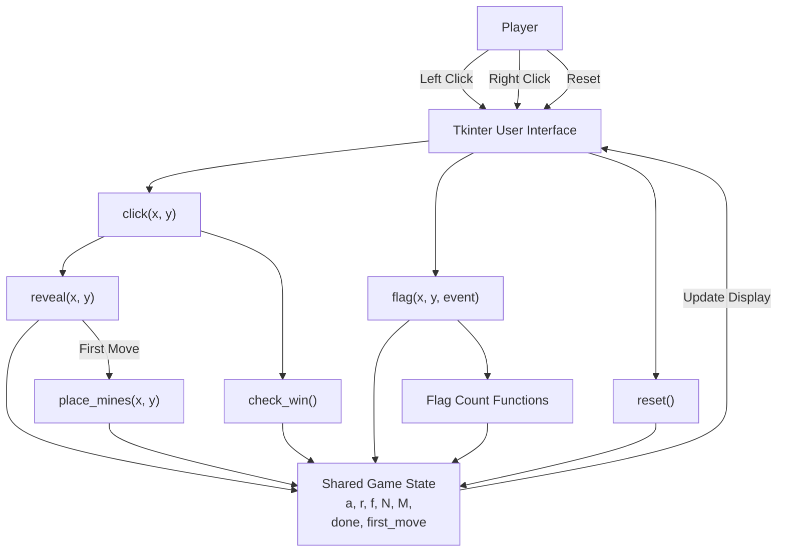
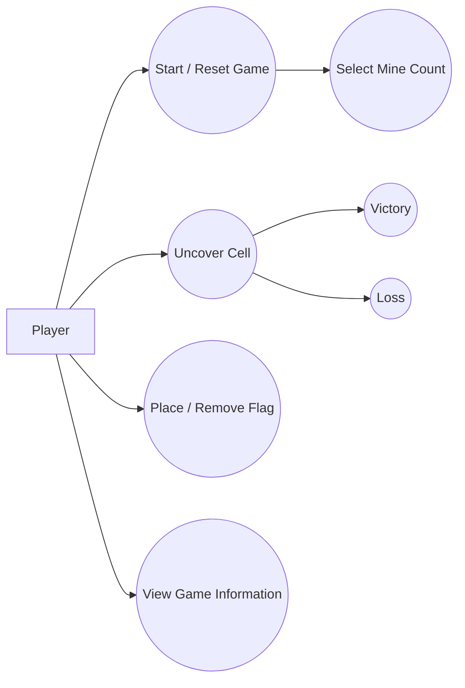
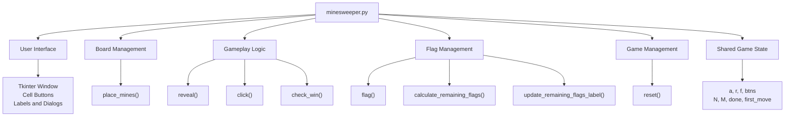
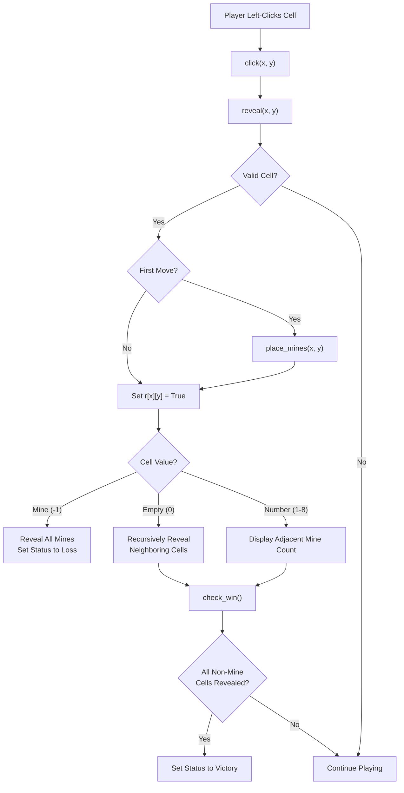
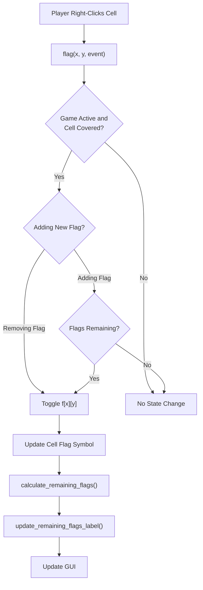
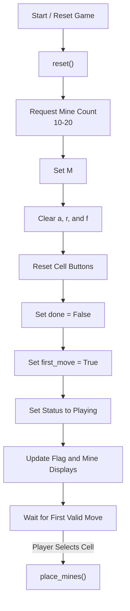
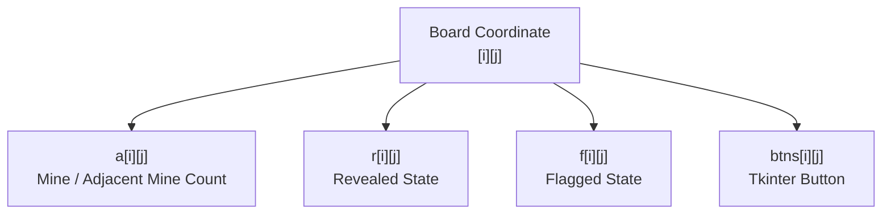

---

# Group 20

---

# Minesweeper
**Version:** 1.4   
**Date:** 09/20/2026  
**Document Identifier:** MS-SA-1.4

---

# Software Architecture Document
## Version 1.4

| Date | Version | Description | Author |
|------|---------|-------------|--------|
| 09/09/2026 | 1.0 | Initial creation of Software Architecture Document | Ivan Kullaya |
| 09/16/2026 | 1.1 | Added Introduction (Sections 1.1-1.5) | Ivan Kullaya |
| 09/17/2026 | 1.2 | Added Architecture based on current Minesweeper implementation (Sections 2-3.3) | Ivan Kullaya |
| 09/19/2026 | 1.3 | Added Sections 4-10 based on current Minesweeper implementation | Ivan Kullaya |
| 09/20/2026 | 1.4 | Updated architecture to reflect final Minesweeper implementation | Ivan Kullaya |

## Table of Contents

1. Introduction
   - 1.1 Purpose
   - 1.2 Scope
   - 1.3 Definitions, Acronyms, and Abbreviations
   - 1.4 References
   - 1.5 Overview
2. Architectural Representation
3. Architectural Goals and Constraints
   - 3.1 Architectural Goals
   - 3.2 Architectural Constraints
   - 3.3 Design Rationale
4. Use-Case View
   - 4.1 Use-Case Realizations
5. Logical View
   - 5.1 Overview
   - 5.2 Architecturally Significant Components
   - 5.3 Relationships Between Components
6. Data Flow
   - 6.1 Cell Reveal Data Flow
   - 6.2 Flag Data Flow
   - 6.3 Game Reset Data Flow
7. Key Data Structures
   - 7.1 Board Value Representation
   - 7.2 Relationship Between Board Structures
8. Interface Description
   - 8.1 Game Board
   - 8.2 Player Input
   - 8.3 Game Information
   - 8.4 Cell Display
9. Quality and Extensibility

# 1. Introduction

## 1.1 Purpose

This document describes the software architecture of the Minesweeper application developed for EECS 581 Project 1. It explains the organization of the system, major software components, interactions between components, data flow, key data structures, user interface, and design decisions.

The purpose of this document is to provide developers with an understanding of how the Minesweeper system is structured and how its components work together. This documentation is also intended to make the system easier to maintain, test, and extend in future development.

## 1.2 Scope

The Minesweeper application is a single-player graphical implementation of the Minesweeper game. The system uses a fixed 10x10 game board and allows the player to select between 10 and 20 mines at the beginning of a game.

In the current implementation, the player interacts with the board using mouse input. Left-clicking uncovers cells, while right-clicking places or removes flags. The system calculates adjacent mine counts, recursively reveals empty areas, prevents the first selected cell and its surrounding cells from containing mines, detects win and loss conditions, and displays game information through a graphical user interface.

Mine placement occurs after the player's first valid cell selection. The first selected cell and its neighboring cells are excluded from mine placement, creating a safe area around the player's first move.

The application is implemented in Python using the Tkinter library for the graphical user interface.

## 1.3 Definitions, Acronyms, and Abbreviations

- **Cell**: An individual position on the 10x10 Minesweeper board
- **First Move**: The first cell selected by the player after starting or resetting a game
- **Flag**: A marker placed by the player on a covered cell believed to contain a mine
- **Game State**: Data describing the current condition of the board and game
- **GUI**: Graphical User Interface
- **Mine**: A hidden game element that causes a loss when uncovered
- **MVP**: Minimum Viable Product
- **Tkinter**: Python library used to create the graphical user interface

## 1.4 References

- EECS 581 Project 1 – Minesweeper Requirements, Professor Hossein Saiedian, Fall 2026
- Project source code (`src/minesweeper.py`)

## 1.5 Overview

The Minesweeper application uses a single-module, event-driven architecture. The implementation is contained within minesweeper.py.

Player actions in the Tkinter interface generate events that call functions responsible for revealing cells, placing flags, resetting the game, and updating the interface. These functions operate on shared data structures representing the board and current game state.

Although the implementation is contained in one module, the system can be logically separated into board management, gameplay logic, flag management, game-state management, and user-interface responsibilities.

# 2. Architectural Representation

The Minesweeper application follows an event-driven architecture. The player interacts with Tkinter interface elements, and those interactions trigger functions that modify the current game state and update the graphical interface.

The primary logical components are:

- **Board and Mine Management**: Maintains the 10x10 board, randomly places mines, and calculates adjacent mine counts.
- **Flag Management**: Places and removes flags and calculates the number of remaining flags.
- **Game Logic**: Processes cell reveals, recursive uncovering, first-move protection, and win/loss conditions.
- **Game State Managemen**t: Maintains information about revealed cells, flagged cells, mine locations, the selected mine count, and whether the game has ended.
- **Shared Game State**: Stores board values, revealed cells, flagged cells, game status, and first-move status.
- **User Interface**: Creates the game window, buttons, labels, coordinate indicators, and reset control using Tkinter.

High-Level System Architecture:

**Figure 1: High-Level System Architecture.** The Tkinter user interface receives player actions and directs them to the appropriate functions. These functions interact with the shared game state, and resulting changes are displayed through the graphical user interface.

# 3. Architectural Goals and Constraints

The architecture of the Minesweeper is designed to meet both functional requirements and important quality attributes while staying within the limits of the project.

## 3.1 Architectural Goals

The primary architectural goals of the Minesweeper system are:

- **Correctness**: The system should correctly implement the required Minesweeper rules, including mine placement, cell uncovering, flagging, adjacent mine calculation, first-move safety, and win/loss detection.
- **Usability**: The graphical interface should provide a simple and understandable way for the player to interact with the game. Board coordinates, buttons, flags, mine counts, and revealed cells should be clearly displayed.
- **Maintainability**: Game functionality is divided among functions with specific responsibilities so that individual behaviors can be modified without rewriting the entire application.
- **Reliability**: The system should prevent invalid game actions, such as revealing an already revealed cell or uncovering a flagged cell.
- **Extensibility**: The organization of the program should allow future developers to add or modify functionality, such as additional game settings, interface improvements, or new game features.

## 3.2 Architectural Constraints

The application must follow the requirements established for EECS 581 Project 1. 

Major constraints include:
- The board must contain exactly 10 rows and 10 columns.
- Columns are identified A-J and rows are identified 1-10.
- The player must be able to select between 10 and 20 mines.
- Mines must be randomly placed.
- The first selected cell must not contain a mine. (The current implementation additionally protects cells surrounding the first selected cell.)
- Covered cells may be flagged or unflagged.
- Flagged cells cannot be uncovered until unflagged.
- Cells with no adjacent mines recursively reveal surrounding cells.
- The game must detect both victory and loss conditions. (Uncovering a mine results in a loss and reveals all mines, revealing all non-mine cells results in victory.)
- The user interface must display the board and relevant game information. (The application is currently implemented in Python using Tkinter.)

## 3.3 Design Rationale

Python was selected for the current implementation because it allows the game logic and graphical interface to be developed with relatively little code. Tkinter provides built-in support for windows, buttons, labels, dialogs, and mouse events without requiring an additional graphical framework.

A single-module implementation was used for the initial version because the Minesweeper system is relatively small and the approach allowed the team to quickly develop a functional MVP. Functions divide the major responsibilities within the module while shared data structures maintain the current game state.

Future development may separate these responsibilities into additional modules or classes if the size and complexity of the application increase.

# 4. Use-Case View

The primary actor is the Player.

**Figure 2: Minesweeper Use-Case View.** The player interacts with the system by starting or resetting a game, selecting the number of mines, uncovering cells, placing or removing flags, and viewing game information. Uncovering cells can ultimately result in either victory or loss.

## 4.1 Use-Case Realizations

### Start or Reset Game

The player begins a game through reset(). A Tkinter dialog requests a mine count between 10 and 20. The function clears previous board information, flags, and revealed states and resets done and first_move.

The game status is set to Playing, and the remaining-flags display is updated.

### Uncover Cell

The player left-clicks a board cell, causing Tkinter to call click(x, y). If the game is active, click() calls reveal(x, y).

reveal() verifies that the coordinates are valid and that the selected cell has not already been revealed or flagged.

### First Move

If first_move is true, reveal() calls place_mines(x, y) before uncovering the selected cell.

place_mines() creates a safe region containing the selected cell and its neighboring cells. Mines are randomly distributed among the remaining board positions. Adjacent mine counts are then calculated for each non-mine cell.

### Recursive Reveal

If a revealed cell has zero adjacent mines, reveal() recursively calls itself for surrounding coordinates. This process continues until the empty region and its bordering numbered cells have been revealed.

### Place or Remove Flag

The player right-clicks a covered cell, triggering flag(). The function toggles the corresponding value in the flag-state array and updates the cell's visual appearance.

The system prevents additional flags from being placed when the remaining flag count reaches zero.

### Victory

After reveal() completes, click() calls check_win() if the game has not already ended.

check_win() determines whether the number of revealed cells equals the total number of non-mine cells. If so, done becomes true, the game status displays Victory, and a victory dialog is shown.

### Loss

If reveal() uncovers a cell containing -1, the player loses. All mines are displayed. The mine that caused the loss is displayed with a red background, while the remaining mines are revealed separately.

The game status changes to Game Over: Loss, and the player is asked whether they want to play again.

# 5. Logical View

## 5.1 Overview

Although the application consists of one Python module, the implementation can be logically separated according to responsibility:

**Figure 3: Logical Components of the Minesweeper System.** The single Python module is logically divided into components according to the responsibilities of its functions and shared data.

## 5.2 Architecturally Significant Components

### User Interface

The user interface is implemented using Tkinter. It creates and manages:
- The main Minesweeper window
- 10x10 matrix of cell buttons
- Column labels A-J
- Row labels 1-10
- Reset button
- Remaining-flags label
- Mine-count label
- Game-status label
- Mine-count input dialog
- Victory and loss dialogs

### Board and Mine Management - place_mines()

place_mines() is responsible for creating the underlying mine layout.

It creates a safe region surrounding the player's first selected cell, resets the board data, randomly selects mine coordinates outside the safe region, stores mines using -1, and calculates the number of neighboring mines for every non-mine cell.

### Cell Reveal - reveal()

reveal() controls the uncovering of individual cells.

It's responsibilities include:
- Validating cell coordinates.
- Preventing already revealed cells from being revealed again.
- Preventing flagged cells from being revealed.
- Triggering mine placement on the first move.
- Updating the revealed-state array.
- Detecting a mine and initiating the loss behavior.
- Displaying adjacent mine counts.
- Recursively uncovering neighboring cells when the current value is zero.

### Victory Detection - check_win()

check_win() determines whether all non-mine cells have been revealed.

The victory condition is: Number of Revealed Cells = (N × N) - M

If this condition is satisfied while the game is active, the function sets done to true, updates the game-status label, and displays the victory message.

### Left-Click Handling - click()

click() is the event handler used when a player left-clicks a cell. It calls reveal() while the game is active and then calls check_win() if revealing the cell did not end the game.

### Flag Management - flag()

flag() handles right-click events on cells.

The function:
- Prevents interaction after the game ends.
- Prevents revealed cells from being flagged.
- Prevents new flags when no flags remain.
- Toggles the corresponding value in f.
- Updates the visual flag symbol.
- Updates the remaining-flags display.

### Remaining Flag Calculation - calculate_remaining_flags()

This function counts the number of currently flagged cells and calculates: Remaining Flags = M - Number of Flagged Cells

If the game has ended, the function returns zero.

### Flag Display - update_remaining_flags_label()

This function updates the GUI with the current remaining flag count. It also updates the mine-count label to display the selected number of mines for the current game.

### Game Management - reset()

reset() initializes a new game.

The function:
- Requests a mine count from 10 through 20.
- Stores the selected value in M.
- Clears revealed and flagged states.
- Clears board values.
- Restores cell buttons to their initial appearance.
- Sets done to false.
- Sets first_move to true.
- Sets the game status to Playing.
- Updates the flag and mine displays.

## 5.3 Relationships Between Components

The user interface is responsible for initiating most application behavior.

Left-clicking a cell invokes click(), which uses reveal() to modify the board state and check_win() to determine whether the game has been won.

On the first valid reveal, reveal() calls place_mines() to initialize the mine layout.

Right-clicking invokes flag(), which modifies the flag-state array and calls the remaining-flag functionality to update the interface.

The Reset button invokes reset(), which reinitializes the shared game state and interface.

These components communicate through function calls and shared variables rather than through separate objects or modules.

# 6. Data Flow

The Minesweeper application uses an event-driven data flow. Player actions begin in the Tkinter user interface and trigger functions that read or modify the shared game state. The results of these operations are then displayed through the graphical user interface.

The three primary data flows are cell revealing, flag placement/removal, and game reset.

## 6.1 Cell Reveal Data Flow

When the player left-clicks a cell, the Tkinter interface calls click(x, y). The selected cell is passed to reveal(x, y), which validates the cell and updates the game state.

On the first valid move, place_mines(x, y) generates the mine locations and adjacent mine counts before the selected cell is revealed.

After the reveal is complete, check_win() determines whether all non-mine cells have been uncovered.

**Figure 4: Cell Reveal Data Flow.** A left-click is passed from the Tkinter interface to the gameplay logic. The system validates the selected cell, generates mines when necessary, updates the revealed-cell state, processes the cell value, and checks for victory.

## 6.2 Flag Data Flow

When the player right-clicks a cell, the Tkinter interface invokes flag(x, y, event). The function first determines whether the action is allowed.

A flag cannot be placed on an uncovered cell or after the game has ended. If the player is attempting to add a flag, the system also verifies that at least one flag remains available.

After a valid flag toggle, the flag state stored in f[x][y] is changed and the interface is updated.

**Figure 5: Flag Data Flow.** A right-click is validated before the flag state is changed. Valid flag actions update the shared flag structure, cell display, and remaining-flags information.

## 6.3 Game Reset Data Flow

The reset() function initializes a new game. It is called when the game initially starts, when the player selects the Reset button, or when the player chooses to play again after a loss.

The function requests the desired number of mines, clears the existing board state, resets the graphical buttons, and restores the game-state variables to their initial values.

Mine locations are not generated during the reset process. Mine generation is delayed until the player's first valid cell selection so that the first-move safe area can be determined.

**Figure 6: Game Reset Data Flow.** Resetting initializes the game state and interface but does not immediately generate mines. Mine placement occurs after the player's first valid cell selection.

# 7. Key Data Structures

The Minesweeper system uses several shared data structures to represent the board and maintain the current state of the game. The primary board structures are `a`, `r`, `f`, and `btns`.

Each of these structures uses the same `[i][j]` coordinates, meaning that the values stored at the same row and column position describe different properties of the same Minesweeper cell.

|  Structure  |  Type  |  Description  |
|:-----------:|:------:|:-------------:|
| a | 10x10 integer list | Stores mines and adjacent mine counts |
| r | 10x10 Boolean list | Records whether each cell has been revealed |
| f | 10x10 Boolean list | Records whether each cell is flagged |
| btns | 10x10 Tkinter Button list | Stores the GUI button corresponding to each cell |
| N | Integer | Board dimension, fixed at 10 |
| M | Integer | Number of mines selected for the current game |
| done | Boolean | Records whether the game has ended |
| first_move | Boolean | Records whether mine placement still needs to occur |

## 7.1 Board Value Representation

The a structure stores the underlying contents of each cell. Each position contains an integer representing either a mine or the number of mines adjacent to that cell.

| Value | Meaning |
|:------:|:---------:|
| -10 | The cell contains a mine. |
| 0 | The cell contains no adjacent mines. |
| 1-8 | Number of adjacent mines |

## 7.2 Relationship Between Board Structures

The relationship between these structures is shown below.

**Figure 7: Key Board Data Structures.** The structures a, r, f, and btns use matching [i][j] coordinates. Each structure stores a different property of the same Minesweeper cell.

# 8. Interface Description

The system provides a graphical interface implemented with Tkinter.

## 8.1 Game Board

The primary interface consists of a 10x10 matrix of buttons. Each button corresponds to one Minesweeper cell.

Columns are labeled A through J, while rows are labeled 1 through 10.

## 8.2 Player Input

The interface supports the following actions:

| Input | Result |
|:------:|:---------:|
| Left-click covered cell | Attempts to uncover the cell |
| Right-click covered cell	| Places or removes a flag |
| Reset button | Starts a new game |
| Mine-count dialog | Allows selection of 10-20 mines |

## 8.3 Game Information

The interface displays:

### Remaining Flags:
Displays the number of flags still available to the player.

### Mines:
Displays the total number of mines selected for the current game.

### Game Status:
Displays one of the following states:
- Playing
- Game Over: Loss
- Game Over: Victory

## 8.4 Cell Display

Covered cells are displayed as raised Tkinter buttons.

Flagged cells display a red flag symbol.

Revealed non-mine cells display their adjacent mine count. Cells with zero neighboring mines display no number.

When the player uncovers a mine, all mine locations are displayed. The selected mine that caused the loss is highlighted with a red background.

# 9. Quality and Extensibility

The current architecture provides a functional implementation while remaining small enough for developers to understand the complete system within a single source file.

Individual functions separate important responsibilities such as mine placement, cell revealing, victory detection, flag management, and game resetting. Shared board structures use consistent coordinates, making relationships between game data and interface elements predictable.

The system also performs validation to prevent several invalid actions, including revealing flagged cells, flagging revealed cells, and placing more flags than the selected mine count.

The current architecture does create dependencies between gameplay logic and the Tkinter interface. Several gameplay functions directly modify graphical widgets, and multiple functions access shared global variables. This is manageable for the current project size but should be considered when making larger future extensions.

Known limitations and proposed future improvements are maintained separately in `docs/knownIssues.md`.

---

© Group 20, 2026
