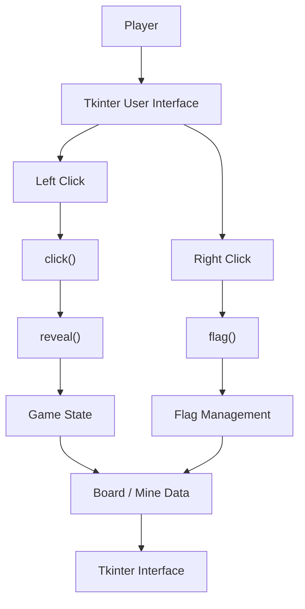

---

# Group 20

---

# Minesweeper
**Version:** 1.2   
**Date:** 09/17/2026  
**Document Identifier:** MS-SA-1.2

---

# Software Architecture Document
## Version 1.0

| Date | Version | Description | Author |
|------|---------|-------------|--------|
| 09/09/2026 | 1.0 | Initial creation of Software Architecture Document | Ivan Kullaya |
| 09/16/2026 | 1.1 | Added Introduction (Sections 1.1-1.5) | Ivan Kullaya |
| 09/17/2026 | 1.2 | Added Architecture based on current Minesweeper implementation (Sections 2-3.3) | Ivan Kullaya |

## Table of Contents

1. Introduction
   - 1.1 Purpose
   - 1.2 Scope
   - 1.3 Definitions, Acronyms, and Abbreviations
   - 1.4 References
   - 1.5 Overview
2. Architectural Representation
3. Architectural Goals and Constraints
   - 3.1 Architectural Goals
   - 3.2 Architectural Constraints
   - 3.3 Design Rationale
4. Use-Case View
   - 4.1 Use-Case Realizations
5. Logical View
   - 5.1 Overview
   - 5.2 Architecturally Significant Components
   - 5.3 Relationships Between Components
6. Data Flow
7. Key Data Structures
8. Interface Description
9. Quality and Extensibility
10. Extension Guide for Project 2
   - 10.1 Component Modification Guide
   - 10.2 Extending the System

# 1. Introduction

## 1.1 Purpose

This document describes the software architecture of the Minesweeper application developed for EECS 581 Project 1. It explains the organization of the system, major software components, interactions between components, data flow, key data structures, user interface, and design decisions.

The purpose of this document is to provide developers with an understanding of how the Minesweeper system is structured and how its components work together. This documentation is also intended to make the system easier to maintain, test, and extend in future development.

## 1.2 Scope

The Minesweeper application is a single-player graphical implementation of the Minesweeper game. The system uses a fixed 10x10 game board and allows the player to select between 10 and 20 mines at the beginning of a game.

The player interacts with the board using mouse input. Left-clicking uncovers cells, while right-clicking places or removes flags. The system calculates adjacent mine counts, recursively reveals empty areas, prevents the first selected cell and its surrounding cells from containing mines, detects win and loss conditions, and displays the remaining number of flags.

The application is implemented in Python using the Tkinter library for the graphical user interface.

## 1.3 Definitions, Acronyms, and Abbreviations

- **Cell**: An individual position on the 10x10 Minesweeper board
- **First Move**: The first cell selected by the player after starting or resetting a game
- **Flag**: A marker placed by the player on a covered cell believed to contain a mine
- **GUI**: Graphical User Interface
- **Mine**: A hidden game element that causes a loss when uncovered
- **MVP**: Minimum Viable Product
- **Tkinter**: Python library used to create the graphical user interface

## 1.4 References

- EECS 581 Project 1 – Minesweeper Requirements, Professor Hossein Saiedian, Fall 2026
- Project source code (`src/minesweeper.py`)

Note: Additional external sources used during implementation will be added to this section as development continues.

## 1.5 Overview

The Minesweeper application is implemented primarily within the minesweeper.py module. The system follows an event-driven design in which user actions within the Tkinter graphical interface trigger functions that update the game state and interface.

The major responsibilities of the system include board and mine management, gameplay logic, flag management, game-state management, and graphical user interaction

# 2. Architectural Representation

The Minesweeper system uses a single-module, event-driven architecture. The current implementation is contained within minesweeper.py, with functionality separated into functions responsible for different areas of the game.

The major logical components are:

- **GUI**: Creates the game window, buttons, labels, coordinate indicators, and reset control using Tkinter.
- **Board and Mine Management**: Maintains the 10x10 board, randomly places mines, and calculates adjacent mine counts.
- **Game Logic**: Processes cell reveals, recursive uncovering, first-move protection, and win/loss conditions.
- **Flag Management**: Places and removes flags and calculates the number of remaining flags.
- **Game State Managemen**t: Maintains information about revealed cells, flagged cells, mine locations, the selected mine count, and whether the game has ended.

A simplified representation of the architecture is:

The graphical interface acts as the connection between the player and the underlying game logic. Player actions trigger event-handling functions, which modify shared game-state data and update the interface accordingly.

# 3. Architectural Goals and Constraints

The architecture of the Minesweeper is designed to meet both functional requirements and important quality attributes while staying within the limits of the project.

## 3.1 Architectural Goals

The primary architectural goals of the Minesweeper system are:

- **Correctness**: The system should correctly implement the required Minesweeper rules, including mine placement, cell uncovering, flagging, adjacent mine calculation, first-move safety, and win/loss detection.
- **Usability**: The graphical interface should provide a simple and understandable way for the player to interact with the game. Board coordinates, buttons, flags, mine counts, and revealed cells should be clearly displayed.
- **Maintainability**: Game functionality is divided among functions with specific responsibilities so that individual behaviors can be modified without rewriting the entire application.
- **Reliability**: The system should prevent invalid game actions, such as revealing an already revealed cell or uncovering a flagged cell.
- **Extensibility**: The organization of the program should allow future developers to add or modify functionality, such as additional game settings, interface improvements, or new game features.

## 3.2 Architectural Constraints

The application must follow the requirements established for EECS 581 Project 1. 

Major constraints include:
- The board must contain exactly 10 rows and 10 columns.
- The player must be able to select between 10 and 20 mines.
- Mines must be randomly placed.
- The first selected cell must not contain a mine. (The current implementation additionally protects cells surrounding the first selected cell.)
- Covered cells may be flagged or unflagged.
- Flagged cells cannot be uncovered until unflagged.
- Cells with no adjacent mines recursively reveal surrounding cells.
- The game must detect both victory and loss conditions.
- The user interface must display the board and relevant game information. (The application is currently implemented in Python using Tkinter.)

## 3.3 Design Rationale

Python was selected for the current implementation because it allows the game logic and graphical interface to be developed with relatively little code. Tkinter provides built-in support for windows, buttons, labels, dialogs, and mouse events without requiring an additional graphical framework.

A single-module implementation was used for the initial version because the Minesweeper system is relatively small and the approach allowed the team to quickly develop a functional MVP. Functions divide the major responsibilities within the module while shared data structures maintain the current game state.

Future development may separate these responsibilities into additional modules or classes if the size and complexity of the application increase.

# 4. Use-Case View

## 4.1 Use-Case Realizations

# 5. Logical View

## 5.1 Overview

## 5.2 Architecturally Significant Components

## 5.3 Relationships Between Components

# 6. Data Flow

# 7. Key Data Structures

# 8. Interface Description

# 9. Quality and Extensibility

# 10. Extension Guide for Project 2

## 10.1 Component Modification Guide

## 10.2 Extending the System

Known limitations and proposed future improvements are maintained separately in `docs/knownIssues.md`.

---

© Group 20, 2026
